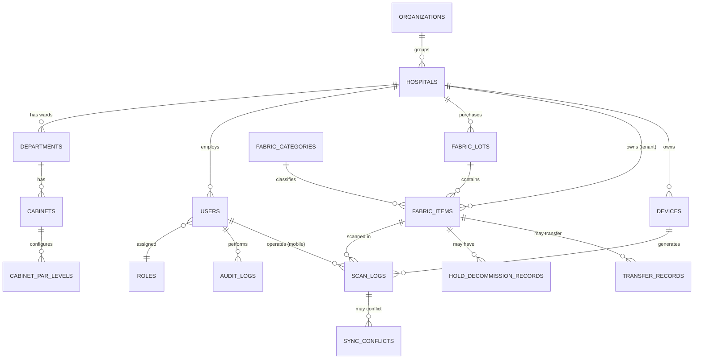

# Data Model / ER Diagram

> อ้างอิงจาก business rule ใน [Advanced_Feature_Details&Rules.md](../Advanced_Feature_Details&Rules.md) และโครงสร้างเมนูใน [PROMPT_MASTER.md](../PROMPT_MASTER.md)

## หลักการออกแบบ

1. **Tenant boundary = `hospital_id`** — "Inter-Hospital Transfer" คือการย้าย `hospital_id` ของผ้าจากโรงพยาบาลหนึ่งไปอีกโรงพยาบาลหนึ่ง ดังนั้นทุกตารางที่เป็นข้อมูลระดับปฏิบัติการต้องมีคอลัมน์ `hospital_id` เสมอ (ดู [multi-tenant-isolation.md](multi-tenant-isolation.md))
2. **`organizations`** เป็นชั้นบนสุด (ระดับกลุ่ม/ภาค) ไว้ให้ HQ Super Admin มองภาพรวมข้าม รพ. — ไม่ใช่ tenant boundary แต่เป็นแค่ grouping
3. **EPC (RFID tag code) เป็น unique key ระดับ global** ไม่ใช่ระดับ tenant เพราะเป็น physical tag ตัวเดียวติดผ้าจริง เวลาโอนย้ายข้าม รพ. ตัว `epc_code` จะไม่เปลี่ยน มีแค่ `hospital_id` ที่เปลี่ยนเจ้าของ
4. ทุกตารางมี audit columns: `created_at`, `updated_at`, `created_by`, `deleted_at` (soft delete — ห้าม hard delete ข้อมูลที่เกี่ยวกับ audit trail)
5. Location ของอุปกรณ์ (`devices`) และ event การสแกน (`scan_logs`) อ้างอิงแบบ polymorphic ผ่าน `location_type` + `location_id` เพราะจุดติดตั้งมีได้หลายแบบ (weight station, folding table, central stock, ward cabinet)

## ER Diagram



## ตารางหลักและ DDL เริ่มต้น

```sql
-- ===== Tenancy =====
CREATE TABLE organizations (
  id            BIGINT UNSIGNED AUTO_INCREMENT PRIMARY KEY,
  name          VARCHAR(150) NOT NULL,
  region        VARCHAR(100),
  created_at    DATETIME DEFAULT CURRENT_TIMESTAMP,
  updated_at    DATETIME DEFAULT CURRENT_TIMESTAMP ON UPDATE CURRENT_TIMESTAMP,
  deleted_at    DATETIME NULL
);

CREATE TABLE hospitals (                       -- = TENANT
  id              BIGINT UNSIGNED AUTO_INCREMENT PRIMARY KEY,
  organization_id BIGINT UNSIGNED NOT NULL,
  name            VARCHAR(150) NOT NULL,
  quota_config    JSON,                        -- โควตาต่างๆ ที่ HQ ตั้งให้
  created_at      DATETIME DEFAULT CURRENT_TIMESTAMP,
  updated_at      DATETIME DEFAULT CURRENT_TIMESTAMP ON UPDATE CURRENT_TIMESTAMP,
  deleted_at      DATETIME NULL,
  FOREIGN KEY (organization_id) REFERENCES organizations(id)
);

-- ===== Ward structure: รพ. -> ตึก -> ชั้น -> แผนก -> ตู้ =====
CREATE TABLE departments (                     -- รวม ตึก/ชั้น/แผนก เป็น hierarchy เดียวผ่าน parent_id
  id            BIGINT UNSIGNED AUTO_INCREMENT PRIMARY KEY,
  hospital_id   BIGINT UNSIGNED NOT NULL,
  parent_id     BIGINT UNSIGNED NULL,           -- NULL = ตึก (root level)
  level_type    ENUM('BUILDING','FLOOR','WARD') NOT NULL,
  name          VARCHAR(150) NOT NULL,
  deleted_at    DATETIME NULL,
  FOREIGN KEY (hospital_id) REFERENCES hospitals(id),
  FOREIGN KEY (parent_id) REFERENCES departments(id)
);

CREATE TABLE cabinets (
  id            BIGINT UNSIGNED AUTO_INCREMENT PRIMARY KEY,
  hospital_id   BIGINT UNSIGNED NOT NULL,
  department_id BIGINT UNSIGNED NOT NULL,       -- ต้องเป็น level_type = WARD
  name          VARCHAR(150) NOT NULL,
  deleted_at    DATETIME NULL,
  FOREIGN KEY (hospital_id) REFERENCES hospitals(id),
  FOREIGN KEY (department_id) REFERENCES departments(id)
);

CREATE TABLE cabinet_par_levels (
  id                BIGINT UNSIGNED AUTO_INCREMENT PRIMARY KEY,
  cabinet_id        BIGINT UNSIGNED NOT NULL,
  fabric_category_id BIGINT UNSIGNED NOT NULL,
  par_level_qty     INT UNSIGNED NOT NULL,
  warning_pct       TINYINT UNSIGNED NOT NULL DEFAULT 20,  -- เตือนเมื่อต่ำกว่า % นี้
  FOREIGN KEY (cabinet_id) REFERENCES cabinets(id),
  FOREIGN KEY (fabric_category_id) REFERENCES fabric_categories(id)
);

-- ===== Users & RBAC (รายละเอียดเต็มดู rbac-permissions.md) =====
CREATE TABLE users (
  id            BIGINT UNSIGNED AUTO_INCREMENT PRIMARY KEY,
  hospital_id   BIGINT UNSIGNED NULL,           -- NULL เฉพาะ superadmin (มองทุก tenant)
  role          ENUM('SUPERADMIN','ADMIN','OPERATOR') NOT NULL,
  managed_by    BIGINT UNSIGNED NULL,           -- ใครเป็นคนสร้าง/ดูแล user นี้ (ใช้ตรวจ delegation rule)
  username      VARCHAR(100) NOT NULL UNIQUE,
  password_hash VARCHAR(255) NOT NULL,
  full_name     VARCHAR(150) NOT NULL,
  phone         VARCHAR(30),
  is_active     BOOLEAN NOT NULL DEFAULT TRUE,
  created_at    DATETIME DEFAULT CURRENT_TIMESTAMP,
  updated_at    DATETIME DEFAULT CURRENT_TIMESTAMP ON UPDATE CURRENT_TIMESTAMP,
  deleted_at    DATETIME NULL,
  FOREIGN KEY (hospital_id) REFERENCES hospitals(id),
  FOREIGN KEY (managed_by) REFERENCES users(id)
);

CREATE TABLE refresh_tokens (
  id            BIGINT UNSIGNED AUTO_INCREMENT PRIMARY KEY,
  user_id       BIGINT UNSIGNED NOT NULL,
  token_hash    VARCHAR(255) NOT NULL,
  expires_at    DATETIME NOT NULL,
  revoked_at    DATETIME NULL,
  created_at    DATETIME DEFAULT CURRENT_TIMESTAMP,
  FOREIGN KEY (user_id) REFERENCES users(id)
);

-- ===== Fabric & Lot =====
CREATE TABLE fabric_categories (
  id            BIGINT UNSIGNED AUTO_INCREMENT PRIMARY KEY,
  hospital_id   BIGINT UNSIGNED NOT NULL,
  name          VARCHAR(150) NOT NULL,
  max_wash_cycles INT UNSIGNED,                 -- เกณฑ์เตือนรอบซักสูงสุด
  FOREIGN KEY (hospital_id) REFERENCES hospitals(id)
);

CREATE TABLE fabric_lots (
  id            BIGINT UNSIGNED AUTO_INCREMENT PRIMARY KEY,
  hospital_id   BIGINT UNSIGNED NOT NULL,
  lot_code      VARCHAR(100) NOT NULL,
  purchased_at  DATE,
  quantity      INT UNSIGNED NOT NULL,
  created_by    BIGINT UNSIGNED NOT NULL,
  FOREIGN KEY (hospital_id) REFERENCES hospitals(id),
  FOREIGN KEY (created_by) REFERENCES users(id)
);

CREATE TABLE fabric_items (
  id              BIGINT UNSIGNED AUTO_INCREMENT PRIMARY KEY,
  epc_code        VARCHAR(64) NOT NULL UNIQUE,   -- global unique, ย้าย tenant ได้แต่ epc ไม่เปลี่ยน
  hospital_id     BIGINT UNSIGNED NOT NULL,       -- current tenant owner
  fabric_category_id BIGINT UNSIGNED NOT NULL,
  fabric_lot_id   BIGINT UNSIGNED NULL,
  status          ENUM('WASH','CENTRAL_STOCK','WARD_CABINET','IN_USE_WARD',
                        'HOLD','DECOMMISSIONED','PENDING_DECOMMISSION') NOT NULL,
                        -- WASH = "รับผ้าหลังซัก & ชั่งน้ำหนักผ้า" (ยุบ DRY/WEIGHT_COUNT/FOLDING_QC เดิม
                        -- เข้าด้วยกัน) ดู server/db/migrations/023_consolidate_fabric_statuses.sql
  current_location_type VARCHAR(50),             -- polymorphic: 'CABINET' | 'DEVICE' | 'CENTRAL_STOCK'
  current_location_id   BIGINT UNSIGNED NULL,
  wash_count      INT UNSIGNED NOT NULL DEFAULT 0,
  photo_url       VARCHAR(500),
  created_at      DATETIME DEFAULT CURRENT_TIMESTAMP,
  updated_at      DATETIME DEFAULT CURRENT_TIMESTAMP ON UPDATE CURRENT_TIMESTAMP,
  deleted_at      DATETIME NULL,
  FOREIGN KEY (hospital_id) REFERENCES hospitals(id),
  FOREIGN KEY (fabric_category_id) REFERENCES fabric_categories(id),
  FOREIGN KEY (fabric_lot_id) REFERENCES fabric_lots(id),
  INDEX idx_hospital_status (hospital_id, status)
);

CREATE TABLE hold_decommission_records (
  id            BIGINT UNSIGNED AUTO_INCREMENT PRIMARY KEY,
  fabric_item_id BIGINT UNSIGNED NOT NULL,
  action_type   ENUM('HOLD','DECOMMISSION') NOT NULL,
  reason_code   VARCHAR(100) NOT NULL,
  photo_url     VARCHAR(500),
  created_by    BIGINT UNSIGNED NOT NULL,
  created_at    DATETIME DEFAULT CURRENT_TIMESTAMP,
  FOREIGN KEY (fabric_item_id) REFERENCES fabric_items(id),
  FOREIGN KEY (created_by) REFERENCES users(id)
);

CREATE TABLE transfer_records (
  id                BIGINT UNSIGNED AUTO_INCREMENT PRIMARY KEY,
  fabric_item_id    BIGINT UNSIGNED NOT NULL,
  from_hospital_id  BIGINT UNSIGNED NOT NULL,
  to_hospital_id    BIGINT UNSIGNED NOT NULL,
  approved_by       BIGINT UNSIGNED NOT NULL,     -- ต้องเป็น superadmin หรือ admin ที่มีสิทธิ์ทั้งสองฝั่ง
  transferred_at    DATETIME DEFAULT CURRENT_TIMESTAMP,
  FOREIGN KEY (fabric_item_id) REFERENCES fabric_items(id),
  FOREIGN KEY (from_hospital_id) REFERENCES hospitals(id),
  FOREIGN KEY (to_hospital_id) REFERENCES hospitals(id),
  FOREIGN KEY (approved_by) REFERENCES users(id)
);

-- ===== Devices & Scanning =====
CREATE TABLE devices (
  id              BIGINT UNSIGNED AUTO_INCREMENT PRIMARY KEY,
  hospital_id     BIGINT UNSIGNED NOT NULL,
  device_type     ENUM('WEIGHT_GATE','FOLDING_TABLE','WARD_KIOSK','HANDHELD') NOT NULL,
  install_location_type VARCHAR(50),              -- polymorphic ref
  install_location_id   BIGINT UNSIGNED NULL,
  rssi_threshold_dbm INT NOT NULL DEFAULT -65,
  caretaker_name  VARCHAR(150),
  caretaker_phone VARCHAR(30),
  last_heartbeat_at DATETIME NULL,
  status          ENUM('ONLINE','OFFLINE') NOT NULL DEFAULT 'OFFLINE',
  FOREIGN KEY (hospital_id) REFERENCES hospitals(id)
);

CREATE TABLE scan_logs (
  id              BIGINT UNSIGNED AUTO_INCREMENT PRIMARY KEY,
  hospital_id     BIGINT UNSIGNED NOT NULL,
  fabric_item_id  BIGINT UNSIGNED NOT NULL,
  device_id       BIGINT UNSIGNED NULL,           -- NULL ถ้ามาจาก mobile app ไม่ใช่ fixed reader
  user_id         BIGINT UNSIGNED NULL,           -- ผู้ยิงสแกน (มือถือ)
  event_type      ENUM('WEIGHT_COUNT','BUNDLE_CHECK','WARD_ISSUE','WARD_RECEIVE',
                        'HOLD','DECOMMISSION','TRANSFER') NOT NULL,
  weight_kg       DECIMAL(6,3) NULL,
  rssi_dbm        INT NULL,
  is_step_skipped BOOLEAN NOT NULL DEFAULT FALSE,
  latitude        DECIMAL(10,7) NULL,
  longitude       DECIMAL(10,7) NULL,
  synced_from_offline BOOLEAN NOT NULL DEFAULT FALSE,
  scanned_at      DATETIME NOT NULL,               -- เวลาจริงที่สแกน (อาจต่างจาก created_at ถ้า sync ทีหลัง)
  created_at      DATETIME DEFAULT CURRENT_TIMESTAMP,
  FOREIGN KEY (hospital_id) REFERENCES hospitals(id),
  FOREIGN KEY (fabric_item_id) REFERENCES fabric_items(id),
  FOREIGN KEY (device_id) REFERENCES devices(id),
  FOREIGN KEY (user_id) REFERENCES users(id),
  INDEX idx_fabric_scanned (fabric_item_id, scanned_at)
);

-- ===== Audit =====
CREATE TABLE audit_logs (
  id            BIGINT UNSIGNED AUTO_INCREMENT PRIMARY KEY,
  hospital_id   BIGINT UNSIGNED NULL,
  user_id       BIGINT UNSIGNED NOT NULL,
  action        VARCHAR(150) NOT NULL,
  entity_type   VARCHAR(100) NOT NULL,
  entity_id     BIGINT UNSIGNED NULL,
  metadata      JSON,
  created_at    DATETIME DEFAULT CURRENT_TIMESTAMP,
  FOREIGN KEY (user_id) REFERENCES users(id)
  -- ตารางนี้ห้าม UPDATE/DELETE จาก app user (append-only, ดู multi-tenant-isolation.md)
);
```

> ตาราง `sync_conflicts` และตาราง RBAC เพิ่มเติม (`permissions`, `role_default_permissions`, `user_permission_overrides`) อยู่ในเอกสาร [offline-sync-conflict-resolution.md](offline-sync-conflict-resolution.md) และ [rbac-permissions.md](rbac-permissions.md) ตามลำดับ เพื่อไม่ให้ ER หลักรกเกินไป
